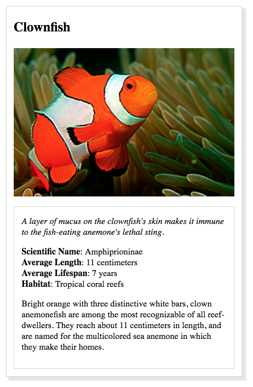
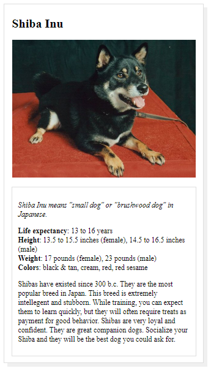

# udacity-animal-trading-card
This project was submitted to Udacity during the Intro to Programming Nanodegree course. The project asks for an animal trading card, styled as close as possible to Udacity's prototype using HTML and CSS.

### Prototype:
 

 
### Project Final:
 

